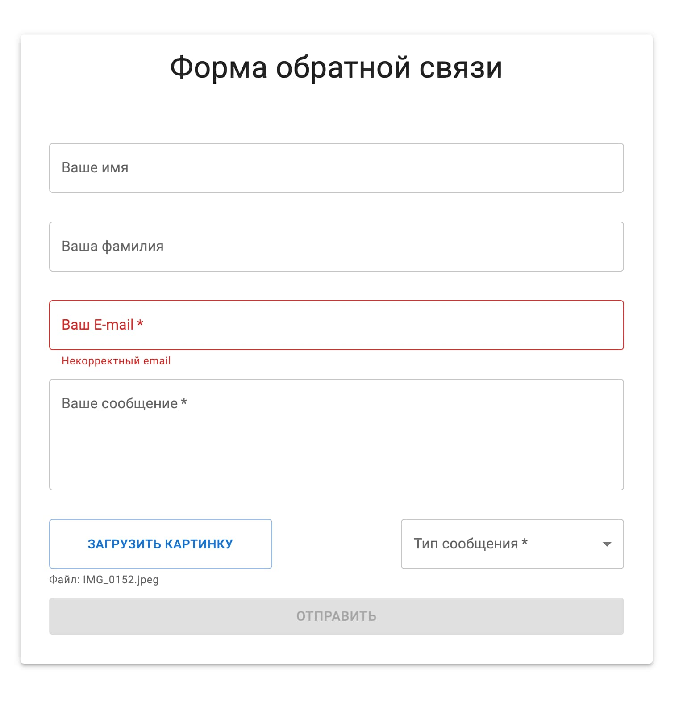

## Форма обратной связи

---
Форма с валидацией:
 - email - обязательное поле
имя, фамилия - должно быть заполнено одно из двух
 - категория - выпадающий список. Поле обязательное, но значение по умолчанию должно быть пустым. Пустое значение не принимается
 - сообщение - обязательное, минимум 10 символов
 - картинка - формат jpg, png. Размер не более 2Мб

---
### Используемые технологии
- React
- Typescript
- Material UI
- Emotion
 ---
### Ссылка на опубликованную версию:
https://pestrige.github.io/material-form/

---
### Превью:

---
### Инструкции:
1. Клонируйте репозиторий на локальную машину:
~~~
git clone git@github.com:pestrige/material-form.git
~~~
2. Перейдите в папку проекта:
~~~
cd material-form
~~~
4. Установите зависимости:
~~~
npm install
~~~
5. Запустите проект командой:
~~~
npm start
~~~
